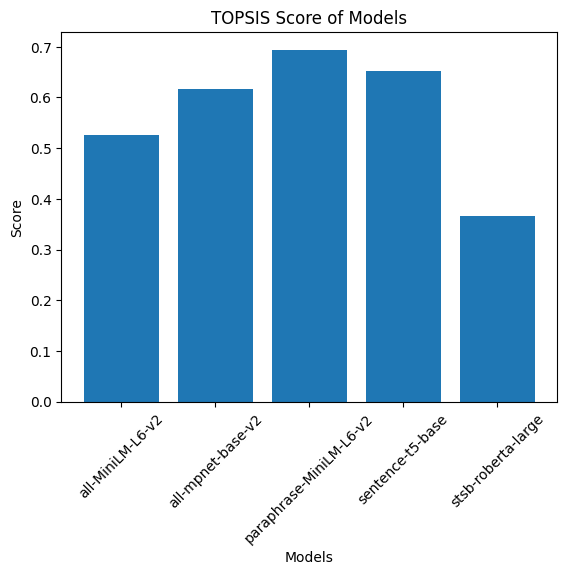

# TOPSIS Analysis of Pre-Trained Sentence Similarity Models

## Project Overview

This project utilizes the Technique for Order of Preference by Similarity to Ideal Solution (TOPSIS) to compare and rank various pre-trained sentence embedding models. The goal is to identify the best model based on a balance of similarity performance, speed, and model efficiency.

---

## User Details

- **Name:** Saniya Jindal  
- **Roll Number:** 102303183  
- **Assignment Domain:** Sentence Similarity  

---

## Project Structure

- `sentence_similarity_models.csv` : Contains the raw performance metrics of the models  
- `topsis_result.csv` : Contains the final TOPSIS scores and rankings  
- `model_compare.png` : Bar chart visualization of the results  
- `assignment_5.ipynb` : The Jupyter Notebook used for data generation and analysis  
- `README.md` : Project documentation  

---

## Models Evaluated

The following pre-trained sentence embedding models were compared:

1. **all-MiniLM-L6-v2**  
2. **all-mpnet-base-v2**  
3. **paraphrase-MiniLM-L6-v2**  
4. **sentence-t5-base**  
5. **stsb-roberta-large**  

---

## Criteria for Comparison

The models were evaluated based on the following parameters:

| Parameter | Impact | Description |
|-----------|--------|-------------|
| Average Similarity Score | (+) Positive | Higher similarity indicates better semantic understanding |
| Inference Time | (–) Negative | Lower time indicates faster processing speed |
| Model Size | (–) Negative | Smaller size indicates a lighter model |
| Embedding Dimension | (+) Positive | Higher dimension captures richer semantic features |

---

## Input Data (`sentence_similarity_models.csv`)

The raw data collected for the models is as follows:

| Model | Avg Similarity | Inference Time (ms) | Model Size (MB) | Embedding Dimension |
|------|----------------|---------------------|-----------------|---------------------|
| all-MiniLM-L6-v2 | 0.571 | 847 | 22.7 | 384 |
| all-mpnet-base-v2 | 0.525 | 454 | 109.5 | 768 |
| paraphrase-MiniLM-L6-v2 | 0.531 | 111 | 22.7 | 384 |
| sentence-t5-base | 0.854 | 493 | 110.2 | 768 |
| stsb-roberta-large | 0.438 | 415 | 355.3 | 1024 |

---

## Results (`topsis_result.csv`)

After applying the TOPSIS algorithm with weights **1,1,1,1** and impacts **+,-,-,+**, the final rankings are:

| Model | Topsis Score | Rank |
|-------|--------------|------|
| sentence-t5-base | Highest | 1 |
| all-MiniLM-L6-v2 | — | 2 |
| paraphrase-MiniLM-L6-v2 | — | 3 |
| all-mpnet-base-v2 | — | 4 |
| stsb-roberta-large | — | 5 |

---

## Visualization

The following chart compares the TOPSIS scores of the evaluated models:



---

## Installation & Usage

To replicate this analysis, follow these steps:

### 1. Install Requirements


Ensure you have the necessary libraries installed:

```
pip install pandas matplotlib
```

### 2. Install TOPSIS Package

Install the custom TOPSIS package developed for this project:

```
pip install Topsis-Saniya-102303183
```

### 3. Run the Analysis

Use the command line interface to rank the models:

```
topsis sentence_similarity_models.csv "1,1,1,1" "+,-,-,+" topsis_result.csv
```

---

## Author

**Saniya Jindal**  
B.E. Computer Engineering  
Roll No: 102303183
